When we come across with Microsoft Sentinel log ingestion we must pay attention to data that is being sent and how we can use it, in order to help us to detect environmental threats. We should also watch if we have duplicate data, so that we can improve and also reduce the costs of a solution such as Microsoft Sentinel(not cheap! =D). It can happen in some cases of ingesting duplicate data in different tables and can generate an unnecessary additional cost. 

**Introduction**

Ingestion-time data transformation provides customers with more control over the ingested data. Supplementing the pre-configured, hardcoded workflows that create standardized tables, ingestion time-transformation adds the capability to filter and enrich the output tables, even before running any queries. Custom log ingestion uses the Custom Log API to normalize custom-format logs so they can be ingested into certain standard tables, or alternatively, to create customized output tables with user-defined schemas for ingesting these custom logs.

**The Problem**

When we set up a new data connector that uses CEF or Syslog, we need a log collector so that Microsoft Sentinel can ingest those logs so we can use it to create use cases and more. However, as soon as we install the collector, following Microsoft's recommendations, we get the following message below, which informs us about using the same collector as Syslog and CEF:

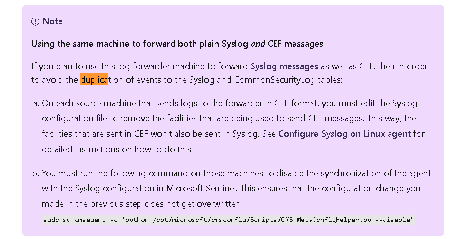

In this scenario, we can choose to deactivate all facilities and use only Syslog, or just configure the equipment that will be sent to a specific facility and deactivate this option in the Data Collection configuration. But what about when we have equipment that send CEF and Syslog and use the same facility? It is no longer feasible to deactivate the facility using Data Collection, as we would no longer receive logs from any equipment.

The possible solutions we have on the table are:

• Separate the collectors so that each one receives a type of log (Syslog/CEF) - But in this scenario, what if the client had a budget problem, and didn't have the capital to create more than one collector, for example; This solution would not be viable.
• Using Data Transformation - What seems to be the best solution for this scenario, because we can filter what exactly we want.

**Syslog vs CEF - A brief explanation**

Syslog is an event logging protocol that is common to Linux. You can use the Syslog daemon built into Linux devices and appliances to collect local events of the types you specify, and have it send those events to Microsoft Sentinel using the Log Analytics agent for Linux (formerly known as the OMS agent).

The Common Event Format (CEF) is an ArcSight standard that aligns the output format of various technology vendors into a common form.

Many network, security appliances, and devices send their logs in the CEF format over Syslog. This format includes more structured information than Syslog, with information presented in a parsed key-value arrangement. If your appliance or system sends logs over Syslog using CEF, the integration with Microsoft Sentinel allows you to easily run analytics and queries across the data.

CEF normalizes the data, making it more immediately useful for analysis with Microsoft Sentinel. Microsoft Sentinel also allows you to ingest unparsed Syslog events, and to analyze them with query time parsing.

Below is a working example of a CEF/Syslog collector using the LogAnalytics Agent. Note that in the configuration we use CEF, TCP, 25226 and Syslog, UDP, 25224. These ports are used by the agent to send logs to Microsoft Sentinel Workspace through RestAPI over TLS on port 443.

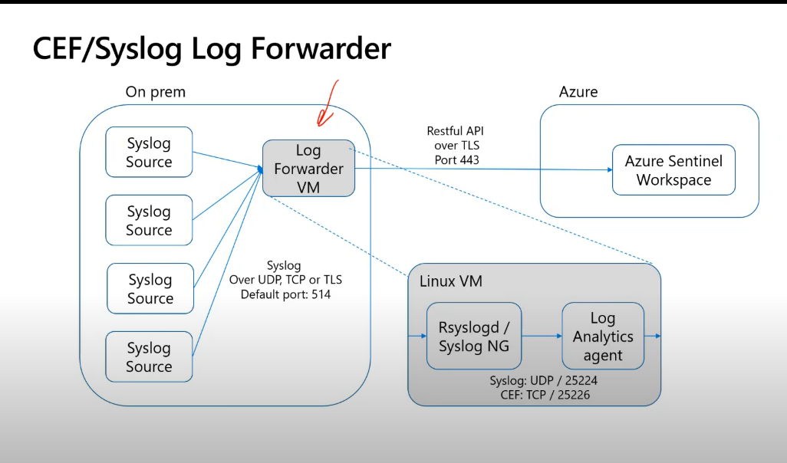

**Solution: Data Transformation**

As we know for the operation and sending of logs via CEF, it is necessary to use Syslog for this, and there we have the problem with regard to duplicate logs in Microsoft Sentinel.

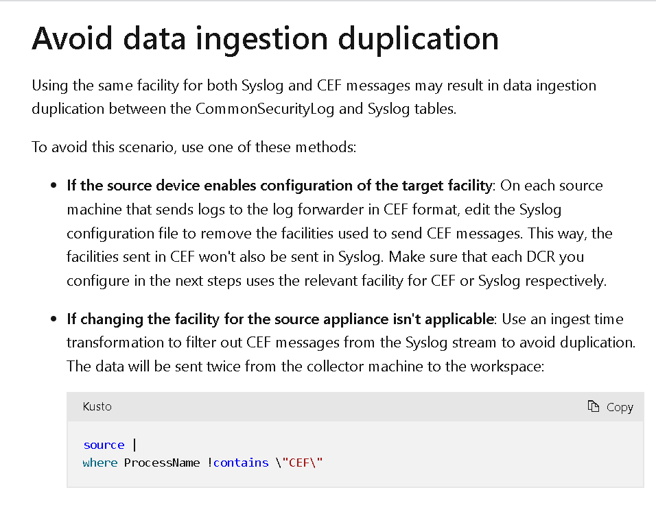

A brief explanation of Data Transformation...

Azure Monitor's Log Analytics serves as the platform behind the Microsoft Sentinel workspace. All logs ingested into Microsoft Sentinel are stored in Log Analytics by default. From Microsoft Sentinel, you can access the stored logs and run Kusto Query Language (KQL) queries to detect threats and monitor your network activity.
Log Analytics' custom data ingestion process gives you a high level of control over the data that gets ingested. It uses data collection rules (DCRs) to collect your data and manipulate it even before it's stored in your workspace. This allows you to filter and enrich standard tables and to create highly customizable tables for storing data from sources that produce unique log formats.

Microsoft Sentinel gives you two tools to control this process:
	• The Logs ingestion API allows you to send custom-format logs from any data source to your Log Analytics workspace, and store those logs either in certain specific standard tables, or in custom-formatted tables that you create. You have full control over the creation of these custom tables, down to specifying the column names and types. You create Data collection rules (DCRs) to define, configure, and apply transformations to these data flows.
	• Data collection transformation uses DCRs to apply basic KQL queries to incoming standard logs (and certain types of custom logs) before they're stored in your workspace. These transformations can filter out irrelevant data, enrich existing data with analytics or external data, or mask sensitive or personal information.

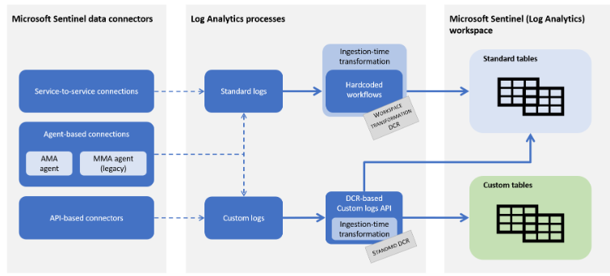

Basically we can transform the logs that are being sent to LogAnalytics Workspace through DCRs and KQL, and with that we can filter the data that is sent. Note that we will still receive these logs, but as we are filtering, these CEF logs will not be sent to the Syslog table, and with that we will not have a higher cost with irrelevant data.

**How-to - Config Data Transformation** 

As mentioned below, we are going to configure the Data Transformation, as Microsoft Sentinel uses the LogAnalytics Workspace, we must perform this configuration directly in the LogAnalytics Workspace.

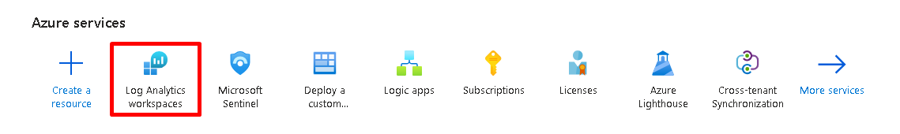

Then we must select the Workspace where we are using Microsoft Sentinel, and select "TABLES"

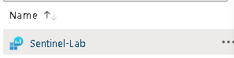

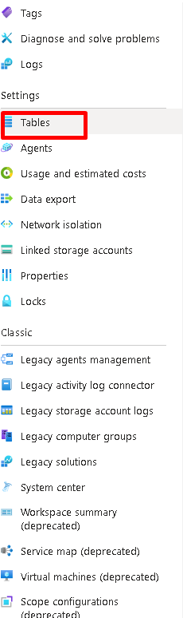

Note that not all tables support this type of configuration. Below is a list of supported Custom Data Connectors.

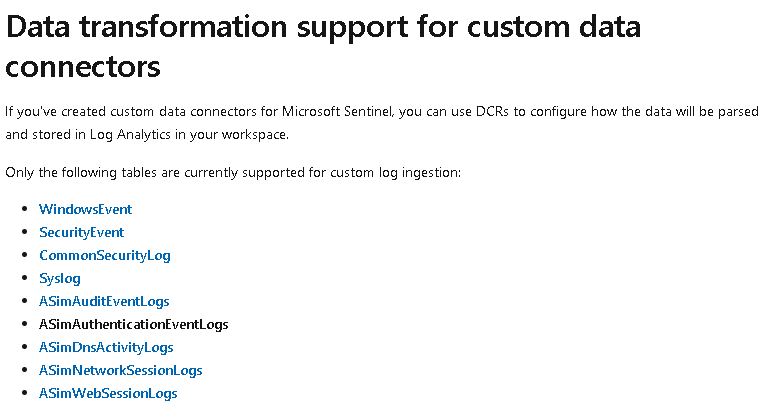

We must then select "Edit Transformation" 

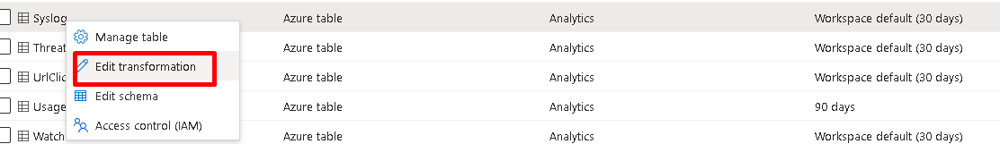

As documented by Microsoft, it is necessary to include a query using KQL to filter the logs that are being sent in CEF to the Syslog table.

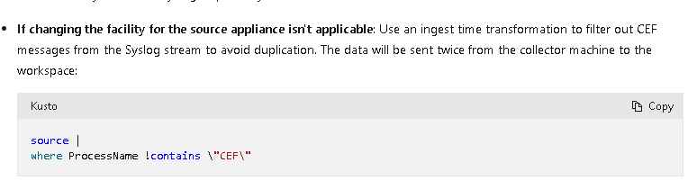

Select "Transformation editor".

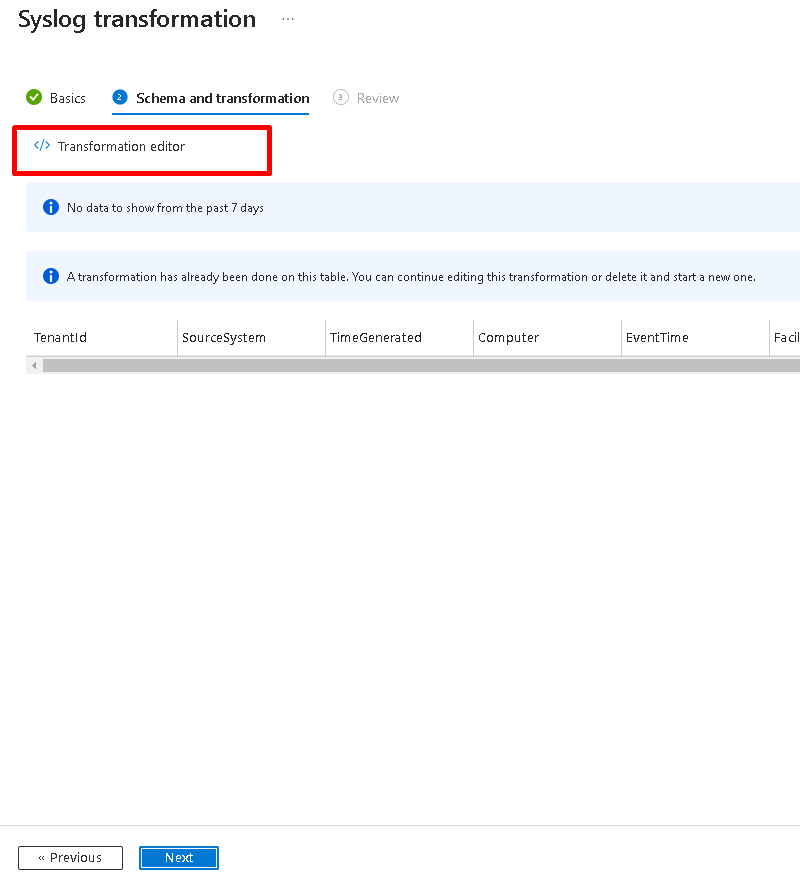

Then define the query that we will use to filter. Note that we can be more granular, such as editing a specific device, or configuring more conditions, but for our example we will just filter from the Syslog table, everything that contains the word "CEF" from the column "ProcessName".

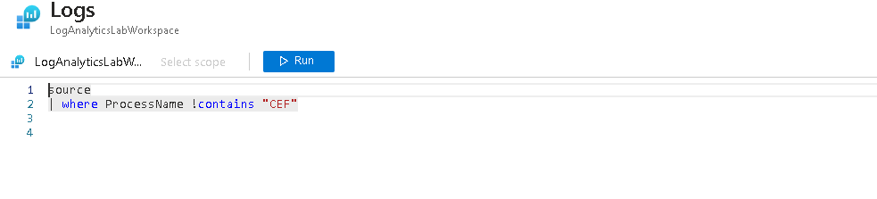

We can finish the configuration, if you don't have a DCR (Data Collection Rule) defined, we have the option to create it. However for our example, we already have this option set.

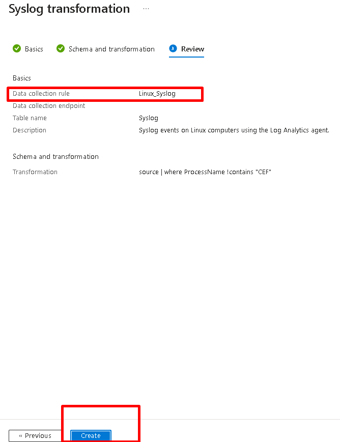

Then wait a few minutes (around 5 minutes) for the changes to be applied.

*Microsoft´s articles and documentation about this:*

https://learn.microsoft.com/en-us/azure/sentinel/configure-data-transformation
https://learn.microsoft.com/en-us/azure/azure-monitor/essentials/data-collection-transformations 
https://learn.microsoft.com/en-us/azure/sentinel/connect-cef-syslog
https://learn.microsoft.com/en-us/azure/azure-monitor/logs/tables-feature-support